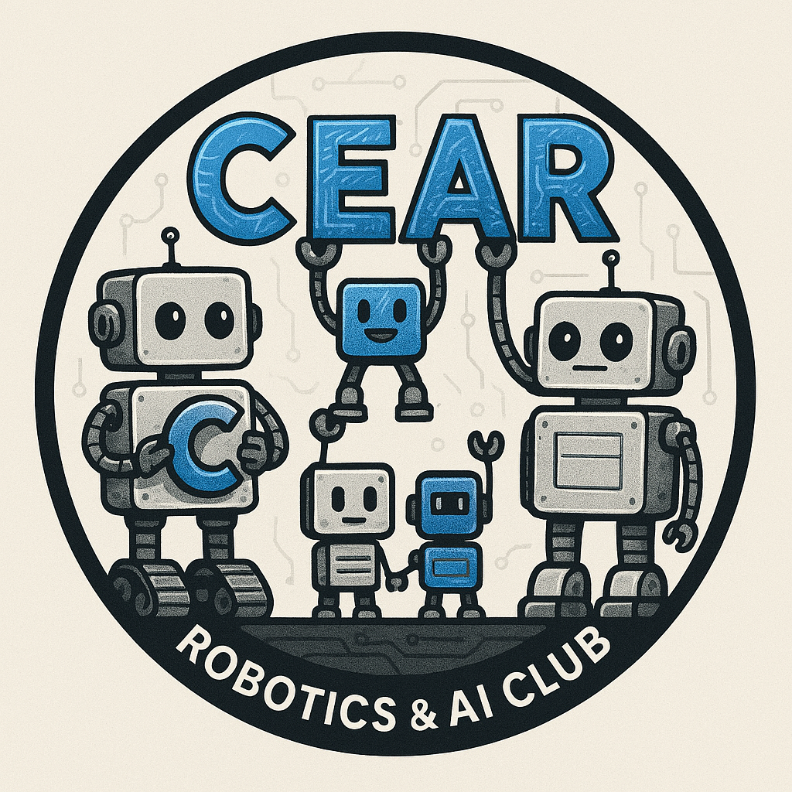

<div align="center">

  

  # 🤖 CEAR AIT
  ### Centre of Excellence for AI & Robotics
  **Army Institute of Technology (AIT), Pune**

  <p align="center">
    Next-generation web portal, autonomous robotics fleet showcase, and Wartech tournament arena platform for CEAR Lab 104.
  </p>

  <!-- Live Deployment & Badges -->
  <p align="center">
    <a href="https://cear-ait-website-evk9mlnhn-mahima5681.vercel.app/" target="_blank">
      
    </a>
    <a href="https://github.com/mahimaanchra/cear-ait-website" target="_blank">
      
    </a>
  </p>

  <p align="center">
    
    
    
    
    
    
    
  </p>

  <h4>
    <a href="https://cear-ait-website-evk9mlnhn-mahima5681.vercel.app/">🌐 Explore Live Site</a>
    <span> · </span>
    <a href="#-key-features">✨ Key Features</a>
    <span> · </span>
    <a href="#-getting-started">🚀 Getting Started</a>
    <span> · </span>
    <a href="#-admin-cms--persistence">🛡 Admin CMS</a>
    <span> · </span>
    <a href="#-project-architecture">📁 Architecture</a>
    <span> · </span>
    <a href="https://github.com/mahimaanchra/cear-ait-website/issues">🐛 Report Bug</a>
  </h4>

</div>

---

## 🌐 Live Production Demo

The portal is continuously deployed on Vercel Edge Network:

🔗 **[https://cear-ait-website-evk9mlnhn-mahima5681.vercel.app/](https://cear-ait-website-evk9mlnhn-mahima5681.vercel.app/)**

> **Quick Tour**: Experience the interactive autonomous status indicators, explore defense mechatronics hardware specifications, view high-res archives from Lab 104, test Wartech registration workflows, or access the embedded `/admin` control room.

---

## 📑 Table of Contents

- [Overview](#-overview)
- [Key Features](#-key-features)
- [Tech Stack](#-tech-stack)
- [Getting Started](#-getting-started)
  - [Prerequisites](#prerequisites)
  - [Local Installation](#local-installation)
  - [Environment Variables](#environment-variables)
  - [Build and Run](#build-and-run)
- [Admin CMS & Persistence](#-admin-cms--persistence)
- [Project Architecture](#-project-architecture)
- [API Endpoints](#-api-endpoints)
- [Deployment Guide](#-deployment-guide)
- [Design System & UI Tokens](#-design-system--ui-tokens)
- [Contributing](#-contributing)
- [License & Acknowledgments](#-license--acknowledgments)

---

## ⚡ Overview

The **Centre of Excellence for AI & Robotics (CEAR)** is an interdisciplinary defense engineering and research club at the **Army Institute of Technology (AIT), Pune**. Situated in **Lab 104**, CEAR spearheads student-led innovation across aerial robotics (UAVs), combat robotics, all-terrain rovers (UGVs), autonomous underwater vehicles (AUVs), and neural perception systems.

This production web platform acts as the public face and digital command centre of CEAR, featuring high-fidelity interactive graphics, real-time fleet telemetry interfaces, tournament logistics for Wartech, and an integrated content management system.

---

## ✨ Key Features

| Feature | Description |
| :--- | :--- |
| **🛸 Autonomous Fleet Showcase** | Interactive directory of CEAR engineering platforms (Cerberus UGV, Autonomous Quadrotor, Robotic Manipulators, RoboSoccer units, AUV Jalpari) with tech specs and telemetry status badges. |
| **⚔️ Wartech Arena Hub** | Dedicated championship portal featuring combat track details, downloadable rulebooks via interactive modals, and team registration workflows. |
| **👥 Cadre Hierarchy Directory** | Categorized team showcase highlighting Faculty In-Charge, Student Secretaries, Joint Secretaries, Technical Leads, and Core Contributors. |
| **🔬 Lab 104 & Workshop Archive** | Interactive photography archive with high-resolution lightbox modal viewing, tags, and behind-the-scenes engineering builds. |
| **🛡 Built-in Admin CMS (`/admin`)** | Passcode-protected control panel (`cear@2026`) enabling authorized cadre to update fleet projects, upcoming workshops, and cadre members with instant drag-and-drop media uploads. |
| **🔄 Dual-Layer Persistence** | Fault-tolerant content management: works with cloud **Supabase PostgreSQL & Storage** while maintaining seamless offline local JSON and disk-based fallback. |
| **🎨 Editorial Glassmorphic Design System** | Clean Royal Plum (`#240d2b`), Warm Oat Linen (`#f6f3ee`), and Radiant Tangerine (`#ff6b35`) aesthetic featuring 3D spring tilt cards, cursor spotlight sheen, multi-plane parallax, continuous rotating blueprint radar telemetry, and sliding gallery carousels. |
| **🚀 Production Grade SEO** | Automated sitemap generation (`/sitemap.xml`), robots directives (`/robots.txt`), OpenGraph meta, and zero-error Next.js App Router static prerendering. |

---

## 🛠 Tech Stack

| Layer | Technologies |
| :--- | :--- |
| **Core Framework** | [Next.js 15.2 (App Router)](https://nextjs.org/) with React 19 & Server Components |
| **Language** | [TypeScript 5.7](https://www.typescriptlang.org/) (Strict type checking enabled) |
| **Styling & Layout** | [Tailwind CSS 3.4](https://tailwindcss.com/) with PostCSS & CSS Variables |
| **Animations & Effects** | [Framer Motion 12](https://www.framer.com/motion/), HTML5 Canvas Neural Grids, [canvas-confetti](https://www.npmjs.com/package/canvas-confetti) |
| **Icons & Assets** | [Lucide React](https://lucide.dev/) (Modern vector icons) |
| **Cloud Database & Storage** | [Supabase](https://supabase.com/) (`@supabase/supabase-js`) with client/server fallbacks |
| **Deployment** | [Vercel](https://vercel.com/) (Edge Network CDN & Serverless API functions) |

---

## 🚀 Getting Started

### Prerequisites

Ensure you have the following installed on your machine:
- **Node.js**: `v18.18+` or `v20+` (Run `node -v` to check)
- **Package Manager**: `npm` (v9+) or `pnpm` / `yarn`
- **Git**

### Local Installation

1. **Clone the repository:**
   ```bash
   git clone https://github.com/mahimaanchra/cear-ait-website.git
   cd cear-ait-website
   ```

2. **Install project dependencies:**
   ```bash
   npm install
   ```

### Environment Variables

The project runs out-of-the-box using local JSON storage and fallback handlers. To connect cloud Supabase storage for multi-admin sync, configure your environment file:

1. Copy `.env.example` to `.env.local`:
   ```bash
   cp .env.example .env.local
   ```

2. Populate the keys from your [Supabase Dashboard](https://supabase.com/dashboard):
   ```env
   # Public Supabase credentials
   NEXT_PUBLIC_SUPABASE_URL=https://your-project-id.supabase.co
   NEXT_PUBLIC_SUPABASE_ANON_KEY=eyJhbGciOiJIUzI1NiIsInR5cCI6IkpXVCJ9...

   # Optional Service Role Key (for server-side syncing)
   SUPABASE_SERVICE_ROLE_KEY=eyJhbGciOiJIUzI1NiIsInR5cCI6IkpXVCJ9...
   ```

### Build and Run

- **Start Development Server:**
  ```bash
  npm run dev
  ```
  Open [http://localhost:3000](http://localhost:3000) to view the application with hot module reloading.

- **Create Optimized Production Build:**
  ```bash
  npm run build
  ```

- **Run Production Server Locally:**
  ```bash
  npm run start
  ```

- **Run Linter:**
  ```bash
  npm run lint
  ```

---

## 🛡 Admin CMS & Persistence

The website includes an integrated, zero-friction Content Management System built directly into the Next.js runtime.

- **Route**: [`/admin`](https://cear-ait-website-evk9mlnhn-mahima5681.vercel.app/admin) (or `http://localhost:3000/admin`)
- **Default Access Passcode**: `cear@2026`

### CMS Capabilities:
- **Team / Cadre Management**: Add, update, or remove leadership profiles, domains, designations, and social links.
- **Fleet & Project Showcase**: Edit robotics platforms, specifications, readiness levels, and platform tags.
- **Events & Timeline**: Schedule workshops, hackathons, and induction drives with custom dates and venues.
- **Drag-and-Drop Image Uploader**: Direct upload pipeline via `/api/upload` supporting WebP, PNG, and JPEG assets with client-side preview.
- **Hybrid Storage Engine**:
  - *Cloud Mode*: Persists data into Supabase PostgreSQL tables and uploads media to Supabase Storage bucket.
  - *Offline Mode*: Automatically falls back to `public/customContent.json` and local `public/uploads/` directory when credentials are not configured.

---

## 📁 Project Architecture

```
cear-ait-website/
├── public/
│   ├── cear-logo.png             # Official CEAR branding emblem
│   ├── cear-logo.svg             # Vector badge asset
│   ├── media/                    # Lab 104 archival photography
│   └── uploads/                  # Uploaded assets from Admin CMS
├── src/
│   ├── app/                      # Next.js App Router (15.2)
│   │   ├── layout.tsx            # Root layout with fonts, metadata & providers
│   │   ├── page.tsx              # Main CEAR landing page
│   │   ├── globals.css           # Global Tailwind tokens & cybernetic utilities
│   │   ├── robots.ts             # Search engine crawler policies
│   │   ├── sitemap.ts            # Dynamic XML sitemap generator
│   │   ├── about/                # Detailed CEAR institutional background page
│   │   ├── admin/                # Admin CMS Control Center
│   │   ├── api/                  # Serverless API routes
│   │   │   ├── content/          # GET / POST content synchronization
│   │   │   ├── health/           # System health check endpoint
│   │   │   └── upload/           # Media file upload handler
│   │   ├── projects/             # Comprehensive robotics platforms gallery
│   │   ├── team/                 # Complete cadre & hierarchy directory
│   │   └── wartech/              # Wartech robotics tournament portal
│   ├── components/
│   │   ├── admin/                # CMS Modals & image upload components
│   │   ├── sections/             # Primary UI sections (Hero, About, Fleet, Team, etc.)
│   │   └── ui/                   # Cyber Matrix canvas, glowing cards, modals, badges
│   ├── context/
│   │   └── SiteContentContext.tsx# Centralized state provider & live CMS sync
│   ├── data/
│   │   └── initialContent.ts     # Static seed content & baseline platform specs
│   └── lib/
│       ├── supabase.ts           # Supabase client instantiation & helpers
│       └── utils.ts              # Tailwind class merging (clsx + twMerge)
├── tailwind.config.ts            # Custom tactical theme colors & keyframes
├── tsconfig.json                 # TypeScript compiler specifications
└── package.json                  # Dependencies and execution scripts
```

---

## 🔌 API Endpoints

The internal Next.js serverless API routes handle data serialization and asset pipelines:

| Method | Endpoint | Description | Payload / Response |
| :--- | :--- | :--- | :--- |
| `GET` | `/api/health` | Service uptime and deployment environment check | `{ status: "ok", timestamp: ... }` |
| `GET` | `/api/content` | Fetches active site content (fleet, cadre, events) | `{ projects: [], team: [], events: [] }` |
| `POST` | `/api/content` | Saves and broadcasts updated CMS state | `{ success: true, timestamp: ... }` |
| `POST` | `/api/upload` | Multipart form uploader for platform and profile images | `{ url: "/uploads/filename.webp" }` |

---

## ☁️ Deployment Guide

### Deploying to Vercel (Recommended)

1. Fork or push the repository to GitHub.
2. Sign in to your [Vercel Dashboard](https://vercel.com/).
3. Click **"Add New Project"** and import `cear-ait-website`.
4. In the **Build and Output Settings**, keep defaults:
   - **Framework Preset**: Next.js
   - **Build Command**: `next build`
   - **Output Directory**: `.next`
5. *(Optional)* Add your Supabase environment variables under **Environment Variables**:
   - `NEXT_PUBLIC_SUPABASE_URL`
   - `NEXT_PUBLIC_SUPABASE_ANON_KEY`
   - `SUPABASE_SERVICE_ROLE_KEY`
6. Click **Deploy**. Vercel will build the project and output your production URL.

---

## 🎨 Design System & UI Tokens

The user interface follows a tactical defense aesthetic inspired by military robotics HUDs:

```
Command Obsidian : #070B12  (Base background)
Deep Tactical    : #0D1321  (Surface & container panels)
Slate Navy       : #131B2E  (Elevated cards & modals)
Signal Volt      : #DCF836  (Primary highlight & interactive accents)
Cyber Blue       : #38BDF8  (Secondary telemetry & status pulses)
Muted Foreground : #94A3B8  (Technical specifications & descriptions)
```

---

## 🤝 Contributing

We welcome contributions from AIT cadets, robotics researchers, and open-source developers!

1. Check out the [Contribution Guidelines](CONTRIBUTING.md) for branch naming and commit conventions.
2. Create your feature branch:
   ```bash
   git checkout -b feature/autonomous-quadrotor-telemetry
   ```
3. Ensure all tests and builds pass cleanly:
   ```bash
   npm run build
   ```
4. Commit your changes using conventional commit formats:
   ```bash
   git commit -m "feat(fleet): implement telemetry widget for UGV Cerberus"
   ```
5. Open a Pull Request on GitHub.

---

## 📜 License & Acknowledgments

- **Organization**: [Centre of Excellence for AI & Robotics (CEAR)](https://cear-ait-website-evk9mlnhn-mahima5681.vercel.app/)
- **Institution**: **Army Institute of Technology (AIT)**, Dighi Hills, Alandi Road, Pune - 411015, Maharashtra, India.
- **Facility**: Lab 104 (Robotics & Mechatronics Research Laboratory).
- **Inquiries**: Contact the CEAR Faculty In-Charge or General Secretaries via the portal contact section.

<div align="center">
  <sub>Developed & maintained with precision by the CEAR Cadre at Army Institute of Technology, Pune.</sub>
</div>
